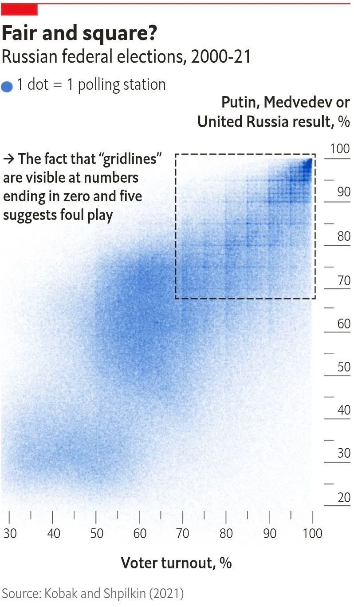
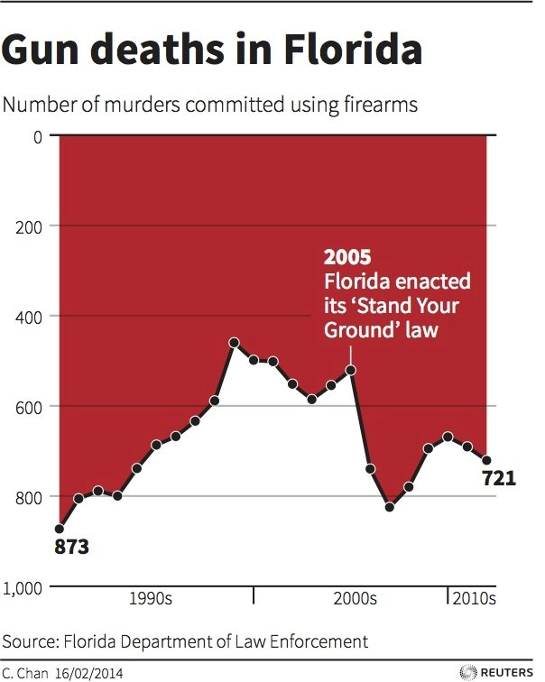
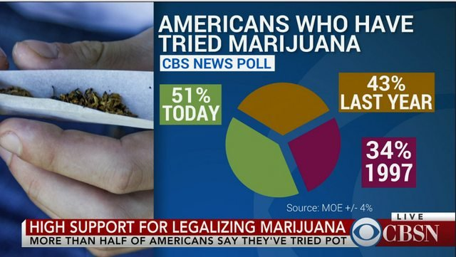
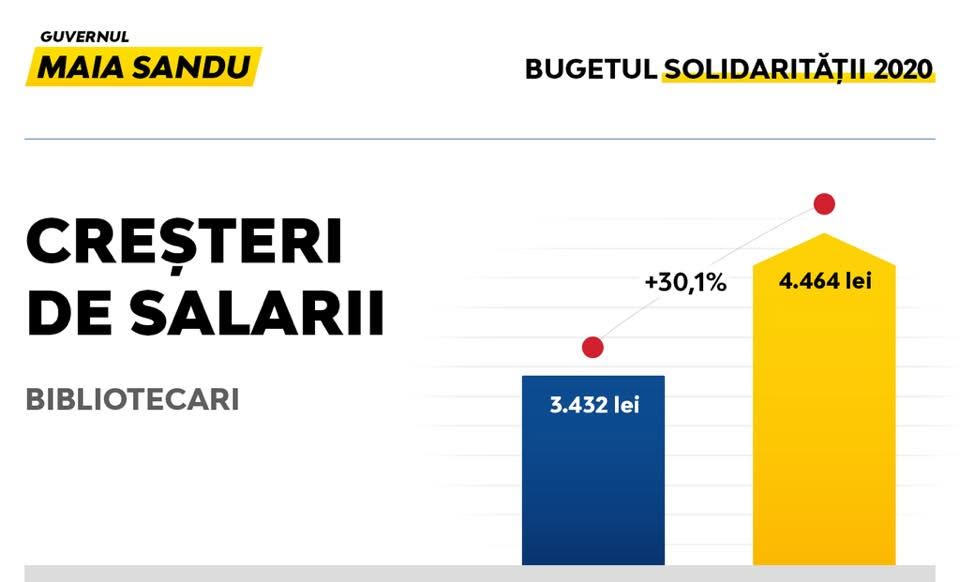

# [👋]{.wave} Bun venit

```{=html}
<style>
  .wave {
  animation-name: wave-animation;  /* Refers to the name of your @keyframes element below */
  animation-duration: 2.5s;        /* Change to speed up or slow down */
  animation-iteration-count: infinite;  /* Never stop waving :) */
  transform-origin: 70% 70%;       /* Pivot around the bottom-left palm */
  display: inline-block;
}

@keyframes wave-animation {
    0% { transform: rotate( 0.0deg) }
   10% { transform: rotate(14.0deg) }  /* The following five values can be played with to make the waving more or less extreme */
   20% { transform: rotate(-8.0deg) }
   30% { transform: rotate(14.0deg) }
   40% { transform: rotate(-4.0deg) }
   50% { transform: rotate(10.0deg) }
   60% { transform: rotate( 0.0deg) }  /* Reset for the last half to pause */
  100% { transform: rotate( 0.0deg) }
}
</style>
```


## Cine sunt eu?

<br>

Mă numesc **Nicu Calcea**.

Sunt **jurnalist de investigație în domeniul datelor**.

Am absolvit și predat la **City, University of London**, și am făcut jurnalism de date la ***Global Witness***, ***BBC News*** și ***New Statesman***. În Moldova am fost co-fondator al [Privesc.Eu](https://privesc.eu/) și reporter la [Moldova.org](https://www.moldova.org/).


## Publicațiile mele

- [Exclusive: Tory MPs would be over £1m worse off in six months with Boris Johnson’s second job ban](https://www.newstatesman.com/politics/uk-politics/2021/11/exclusive-tory-mps-would-be-over-1m-worse-off-in-six-months-with-boris-johnsons-second-job-ban) ([arhivă](https://archive.is/t7Boc))
- [Eight out of ten firms pay men more than women](https://www.bbc.co.uk/news/business-65179430)
- [UK PR firms increased fossil fuels lobbying since Paris Agreement](https://globalwitness.org/en/campaigns/fossil-fuels/uk-pr-firms-increased-fossil-fuels-lobbying-since-paris-agreement/)


# Ce este jurnalismul de date?

> În definiția sa cea mai simplă, jurnalismul de date este practica de a folosi numere și tendințe pentru a spune o poveste. --- **Betsy Ladyzhets**

::: notes
În engleză, jurnalismul de date este numit data journalism, data-driven journalism, computer-assisted reporting sau CAR (în SUA), precision journalism. Istoria sa este chiar mai veche: prima ediție a ziarului The Guardian (Manchester Guardian) a avut un articol de jurnalism de date. Așadar, nu vă concentrați prea mult pe cum îl numiți.
:::

. . .

> Jurnalismul de date este găsirea -- în date -- a materialelor jurnalistice care sunt de interes pentru public și prezentarea lor în cel mai potrivit mod pentru utilizarea și reutilizarea de către public. --- **Bahareh Heravi**

::: notes
Jurnalismul de date nu înseamnă că trebuie să vă limitați la date: facem tot ce fac și alți reporteri, inclusiv interviuri, solicitări de informații, investigații pe teren, scrierea articolelor, redactare, multimedia (când este relevant), fact-checking, etc.
:::


## Procesul

::: columns
::: {.column width="33.33%"}
:::  {.fragment}
##### Întrebare
Ca și în cazul jurnalismului tradițional, jurnalismul de date începe cu o întrebare pe care reporterul vrea să o răspundă.
:::
:::

::: {.column width="33.33%"}
:::  {.fragment}
##### Identificarea surselor
Datele pot veni din surse oficiale, de la societatea civilă, alte terțe părți, sau pot fi colectate direct de către cercetător.
:::
:::

::: {.column width="33.33%"}
:::  {.fragment}
##### Curățarea și structurarea datelor
În majoritatea cazurilor, cercetătorul trebuie să filtreze, sorteze și să corecteze erori sau informații lipsă din setul de date.
:::
:::
:::

## Procesul

::: columns
::: {.column width="33.33%"}
##### Analiza datelor
Cum găsești răspunsul la întrebarea ta în date?
:::

::: {.column width="33.33%"}
:::  {.fragment}
##### Verificarea datelor
Datele nu mint, însă cei care le publică o fac. Au concluziile analizei tale sens? Le poți verifica din alte surse?
:::
:::

::: {.column width="33.33%"}
:::  {.fragment}
##### Prezentare
Analiza poate fi comunicată publicului în mai multe moduri. Uneori, dar nu întotdeauna, jurnaliștii de date vor vizualiza rezultatele analizei.
:::
:::
:::

::: notes
Analyse data: be platform agnostic. Some tools die because APIs change, others are abandoned by their developers, some are replaced by better alternatives.
:::

##

[](https://onlinejournalismblog.com/2011/07/07/the-inverted-pyramid-of-data-journalism/)

::: footer
Sursă: [Paul Bradshaw](https://onlinejournalismblog.com/2011/07/07/the-inverted-pyramid-of-data-journalism/)
:::


## Ce sunt datele deschise?

Definiția oficială:

- **Date oficiale**: Direct din registrele și sistemele instituțiilor publice.
- **Acces gratuit**: Fără înregistrare, accesibil oricui, oricând.
- **Format deschis**: XLS/XLSX, ~~PDF~~, ~~DOCX~~, CSV, ZIP — prelucrabile automat.

::: footer
Sursă: [Agenția de Guvernare Electronică](https://date.gov.md/#:~:text=Date%20deschise%20prin%20defini%C8%9Bie)
:::

## Ce sunt datele deschise?

Eu aș adăuga:

- **Date structurate**: Date publicate în formate accesibile atât pentru oameni, cât și pentru software (CSV, JSON, XML, RDF, nu PDF sau DOCX).
- **Licență deschisă**: Datele pot fi utilizare fără restricții.

## Ce întrebări pot răspunde datele deschise?

- Unde sunt cele mai mari disparități regionale?
- Există diferențe între zonele urbane și rurale?
- Ce categorii de populație beneficiază cel mai puțin de un serviciu public?
- Unde trebuie prioritizate investițiile?
- Ce programe publice produc rezultate?
- Cum s-au schimbat indicatorii după introducerea unei politici?
- Cum poate fi îmbunătățită alocarea resurselor publice?


# Exemple

## Bătrânii pe care nu-i vede algoritmul

[](https://saludconlupa.com/series/invisibles/los-adultos-mayores-que-el-algoritmo-no-ve-las-fallas-del-sistema-que-define-la-pobreza-en-peru/)

::: footer
Surse: [Salud con lupa](https://saludconlupa.com/series/invisibles/los-adultos-mayores-que-el-algoritmo-no-ve-las-fallas-del-sistema-que-define-la-pobreza-en-peru/), [Pulitzer Center](https://pulitzercenter.org/stories/older-adults-algorithm-doesnt-see-flaws-perus-poverty-targeting-system-spanish)
:::

::: notes
In Peru, thousands of older adults live in extreme poverty but are unable to access social programs like Guesthouse 65. The system that determines which households need support has more more than excluded 81,000 people elderly.

Errors stem from poorly collected data, incomplete or outdated records, and a system that on an algorithm to make decisions based on fault and information. In this case, the algorithm is an automatic that calculates a score to estimate a family is extremely poor, or not poor. But if the data is flawed from the start, the algorithm also fails.

Many older people who were excluded were reinstated only after going through long andsome attention to burdens processes.

---

Pe cine nu vede sistemul în Republica Moldova?
:::

## Cum Iranul mișcă petrolul sancționat în toată lumea

<iframe class="stretch" data-src="https://www.reuters.com/graphics/IRAN-OIL/zjpqngedmvx/"></iframe>

::: footer
Sursă: [Reuters](https://www.reuters.com/graphics/IRAN-OIL/zjpqngedmvx/)
:::

## Din verde în sur

<iframe class="stretch" data-src="https://greentogrey.eu/"></iframe>

::: footer
Sursă: [Grenn to Grey](https://greentogrey.eu/)
:::

## Rădăcinile rezistenței

[](https://globalwitness.org/en/campaigns/land-and-environmental-defenders/roots-of-resistance/)

::: footer
Sursă: [Global Witness](https://globalwitness.org/en/campaigns/land-and-environmental-defenders/roots-of-resistance/)
:::

## Mărimi haine

<iframe class="stretch" data-src="https://pudding.cool/2026/02/womens-sizing/"></iframe>

::: footer
Sursă: [The Pudding](https://pudding.cool/2026/02/womens-sizing/)
:::


# Situația din Moldova

## Clasament

[](https://odin.opendatawatch.com/country-profiles/MDA?year=2024)

::: footer
Sursă: [Open Data Inventory](https://odin.opendatawatch.com/country-profiles/MDA?year=2024)
:::

<!-- ## Ce zice OGP?

> Planul de acțiune Open Government Partnership OGP al Republicii Moldova pentru 2023–2025 a înregistrat niveluri ridicate de implementare și o colaborare puternică între guvern și societatea civilă. -->


## Legea 109/2025

- transpune parțial Directiva (UE) 2019/1024 și înlocuiește Legea nr. 305/2012;
- acoperă organismele publice, întreprinderile publice și datele din cercetarea finanțată public;
- introduce seturi de date cu valoare ridicată, reutilizare gratuită (cu excepții) și o licență standard pentru date deschise;
- exclude datele personale și informațiile protejate prin lege.

::: footer
Sursă: [Registrul de stat al actelor juridice](https://www.legis.md/cautare/getResults?doc_id=148946&lang=ro)
:::

## Baze de date {fullscreen=true}

<iframe class="stretch" data-src="https://samizdata.co/training/sources/moldova/"></iframe>

::: footer
Sursă: [SAMIZDATA](https://samizdata.co/training/sources/moldova/)
:::

## Probleme

- Datele sunt deseori publicate în formate inaccesibile (PDF, DOCX) sau neuniforme
- Multe seturi de date nu sunt actualizate la timp, au câmpuri incomplete
- Acces limitat la date în administrația publică locală
- Echilibru neclar cu protecția datelor personale
- Datele existente nu sunt utilizare suficient (ceea ce încercăm să rezolvăm aici)


# Instrumente

<iframe class="stretch" data-src="https://samizdata.co/training/toolbox/"></iframe>

::: footer
Sursă: [SAMIZDATA](https://samizdata.co/training/toolbox/)
:::


# Vizualizarea datelor

## De ce vizualizăm datele? {background-color="#EAE8E3"}

Sintetizarea datelor nu este întotdeauna suficientă pentru a identifica tendințe.

Vizualizarea acestora ne poate oferi informații pe care altfel le-am pierde.


## {#alegeri-rusia data-menu-title="Grafic alegeri Rusia"}




<!-- https://bsky.app/profile/alexselbyb.bsky.social/post/3mvveppnqys2o -->


## Ce putem vizualiza? {.smaller background-color="white"}

Poziție {.absolute top=100 right=50 width="500" height="500"}

::: {.fragment}
Mărime

&nbsp;&nbsp;&nbsp;&nbsp;Lățime {.absolute top=100 right=50 width="500" height="500"}
:::

::: {.fragment}
&nbsp;&nbsp;&nbsp;&nbsp;Înălțime {.absolute top=100 right=50 width="500" height="500"}
:::

::: {.fragment}
&nbsp;&nbsp;&nbsp;&nbsp;Suprafață {.absolute top=100 right=50 width="500" height="500"}
:::

::: {.fragment}
Culoare

&nbsp;&nbsp;&nbsp;&nbsp;Umplutură {.absolute top=100 right=50 width="500" height="500"}
:::

::: {.fragment}
&nbsp;&nbsp;&nbsp;&nbsp;Culoare {.absolute top=100 right=50 width="500" height="500"}
:::

::: {.fragment}
&nbsp;&nbsp;&nbsp;&nbsp;Transparență

&nbsp;&nbsp;&nbsp;&nbsp;Model

Formă {.absolute top=100 right=50 width="500" height="500"}
:::

::: {.fragment}
Locație {.absolute top=100 right=50 width="500" height="500"}
:::


## Ce tipuri de codificare vizuală puteți identifica în acest grafic? {background-color="#fff1e0"}

{.absolute height="500"}

## Graficul de dispersie FT {background-color="#fff1e0"}

::: {.fragment .fade-in-then-out}
Grafic de dispersie {.absolute top=100 right=20 height="450"}
:::

::: {.fragment .fade-in-then-out}
Scară logaritmică {.absolute top=100 right=20 height="450"}
:::

::: {.fragment .fade-in-then-out}
Schimbă mărimile {.absolute top=100 right=20 height="450"}
:::

::: {.fragment .fade-in-then-out}
Colorează {.absolute top=100 right=20 height="450"}
:::

::: {.fragment}
Animează anii {.absolute top=100 right=20 height="450"}
:::

::: notes
https://www.ft.com/content/e2eba288-ef83-11e6-930f-061b01e23655
:::


## Instrumente pentru grafice

<iframe class="stretch" data-src="https://samizdata.co/training/toolbox#visualisation"></iframe>
::: footer
Sursă: [SAMIZDATA](https://samizdata.co/training/toolbox#visualisation)
:::

## Tipuri de grafice

- [FT Vocabulary](https://github.com/Financial-Times/chart-doctor/tree/main/visual-vocabulary)
- [Data Viz Project](https://datavizproject.com/)
- [Data to Viz](https://www.data-to-viz.com/)
- [Data Visualisation Catalogue](https://datavizcatalogue.com/)


## Bare/coloane { background-color="white"}

::: columns
::: {.column width="60%"}

:::

::: {.column width="40%"}
Dreptunghiuri orizontale sau verticale în care lungimile sunt proporționale cu valorile pe care le reprezintă.
<br><br>
Potrivit pentru a compara numere sau a arăta trend-uri.
:::
:::

## Linii { background-color="white"}

::: columns
::: {.column width="60%"}

:::

::: {.column width="40%"}
Arată numere pe o scară continuă. Similar cu graficul de dispersie, doar că punctele sunt conectate.
<br><br>
Potrivit pentru a arăta trend-uri.
:::
:::


## Grafic de suprafață { background-color="white"}

::: columns
::: {.column width="60%"}

:::

::: {.column width="40%"}
Asemănătoare graficelor cu linii, însă suprafață de sub linie este colorată. Suprapuse, pot arăta trend-uri cumulative.
<br><br>
Potrivit pentru a arăta trend-uri.
:::
:::

## Grafic de dispersie { background-color="white"}

::: columns
::: {.column width="60%"}

:::

::: {.column width="40%"}
Reprezintă grafic un set de date pe două dimensiuni continue, fiecare pe o axă diferită (X și Y).
<br><br>
Potrivit pentru a ilustra corelația dintre diferite serii de date.
:::
:::

## Hartă { background-color="white"}

::: columns
::: {.column width="60%"}

:::

::: {.column width="40%"}
Funcționează doar cu date geografice (evident!).
<br><br>
Chiar și în cazul datelor geografice, alte tipuri de diagrame pot fi adesea o alegere mai bună.
:::
:::


## Anatomia unui grafic {background-color="white"}


::: footer
Sursă: [BBC News](https://www.bbc.com/news/business-64322574)
:::

::: notes
- Title
- Subtitle / description
- Series
- Labels
- Gridlines
- x-axix
- y-axis
- Legend/key
- Source
:::

## Alegerea culorilor {background-color="white"}


::: notes
Sequential: Colours (of the same hue) that go from light to dark or the other way around. Usually, darker means higher value.

Diverging: Similar to sequential, but they have a light middle colour that turns darker on both ends of the scale. Useful when you have both positive and negative values.

Categorical: For values that aren't on a numeric scale or don't have an intrinsic order. Useful when none of the colours are more important than others.
:::

::: footer
Sursă: [Datawrapper](https://www.datawrapper.de/blog/which-color-scale-to-use-in-data-vis)
:::


## Instrumente

<iframe class="stretch" data-src="https://samizdata.co/training/toolbox#colours"></iframe>
::: footer
Sursă: [SAMIZDATA](https://samizdata.co/training/toolbox#colours)
:::

::: notes
În funcție de complexitate, putem utiliza:

Excel și Google Sheets pentru analize de bază;

SQL pentru interogarea bazelor de date;

Python sau R pentru analize statistice;

Power BI, Tableau sau alte instrumente pentru vizualizare;

GIS pentru analiza geospațială.

Instrumentul este secundar.

Întrebarea corectă, datele de calitate și metodologia adecvată sunt mai importante decât tehnologia utilizată.
:::


## Grafice eronate: Daily Mail


::: footer
Sursă: [Daily Mail](https://www.dailymail.co.uk/news/article-8028565/EU-leaders-argue-early-hours-bruising-budget-talks.html)
:::

## Grafice eronate: The Sun


::: footer
Sursă: The Sun
:::

## Grafice eronate: Reuters
{.absolute top=90 left=0 height="500"}

::: fragment
{.absolute top=90 left=0 height="456"}
:::

::: footer
Sursă: Reuters
:::

## Grafice eronate: CBS News


::: footer
Sursă: CBS News
:::

## Grafice eronate: PAS


::: footer
Sursă: [Natalia Gavriliță](https://www.facebook.com/NataliaGavrilitaPM/posts/pfbid02MDSpYWRMeEmQcNKjmchqHza77UTSQKwyGxt1Kbaa6JF4dCpitxiH8zXaARfesxMrl)
:::

## Grafice eronate: PAS


::: footer
Sursă: [Natalia Gavriliță](https://www.facebook.com/photo.php?fbid=3736590023025196&set=pb.100063578236855.-2207520000&type=3)
:::

## Grafice eronate: PAS


::: footer
Sursă: [Nicu Calcea](https://www.facebook.com/nicucalcea/posts/pfbid0dLHWpZrKvDac46zLt8vuYax4kUY1eJNVKfhhyf3is3pUSHZpg7VgV2sZNJYnmckml?__tn__=%2CO*F)
:::

## WTF Visualizations

<iframe class="stretch" data-src="https://viz.wtf/"></iframe>
::: footer
Sursă: [WTF Visualizations](https://viz.wtf/)
:::


# Instrumente AI

Inteligența Artificială (AI) poate automatiza anumite procese în jurnalism și analiza de date.

AI-ul însă poate [halucina](https://en.wikipedia.org/wiki/Hallucination_(artificial_intelligence)), și trebuie utilizat responsabil.

## Tipuri de instrumente AI

::: columns
::: {.column width="33.33%"}
:::  {.fragment}
##### Skills
Agenții AI pot căpăta abilități (skills) noi pentru sarcini specifice. Acestea pot fi instalate din surse externe sau create de tine.
:::
:::

::: {.column width="33.33%"}
:::  {.fragment}
##### MCP / Plugin-uri
MCP (Model Context Protocol) este un sistem de plugin-uri standardizat pentru agenții AI. Și acestea pot fi instalate din surse externe.
:::
:::

::: {.column width="33.33%"}
:::  {.fragment}
##### Agenți dedicați
Pentru anumite sarcini, există agenți specializați care pot fi folosiți direct, fără a fi nevoie de configurare sau instalarea skill-urilor sau plugin-urilor.
:::
:::
:::

## Skills

"[Agent Skills](https://agentskills.io/home)" este un standard pentru a extinde abilitățile agenților AI. Pentru jurnalism, abilitățile pot include instrumente de lucru cu PDF-uri sau documente Excel, crearea graficelor, sau accesarea anumitor baze de date.

Skill-urile pot fi create ad-hoc de către agenții AI sau manual de către jurnalist.

## Skills: Exemple

- [Journalism agent skills](https://github.com/jamditis/claude-skills-journalism)
- [Spotlight](https://spotlight.buriedsignals.com/docs/#skills)
- Creează propriile skill-uri

::: notes
Show Moldova investigation skills in an Obsidian vault (research Ion Onțu).
:::

## MCP / Plugin-uri

[MCP (Model Context Protocol)](https://modelcontextprotocol.io/) este un standard pentru a crea instrumente pentru agenții AI.

## MCP: Exemple

- [OpenRegistry](https://openregistry.sophymarine.com/)
- [Datawrapper MCP](https://github.com/palewire/datawrapper-mcp)
- [mcptools](https://posit-dev.github.io/mcptools/) / [btw](https://posit-dev.github.io/btw/) pentru R

::: notes
Show how to use the Datawrapper MCP to reproduce the exercise earlier.
:::

## Agenți dedicați

Pe lângă skill-uri și plugin-uri, jurnaliștii pot utiliza agenți AI creați pentru anumite sarcini specifice. Aceștia sunt de obicei creați de programatori și sunt integrate în alte soft-uri sau platforme.

## Agenți dedicați: Exemple

- [Gemini Notebook (NotebookLM)](https://notebook.google/) | [recomandări pentru jurnalism](https://generative-ai-newsroom.com/practical-recommendations-for-implementing-notebooklm-in-archival-research-5b73bdacdca8)
- [ChatGPT în Excel și Google Sheets](https://chatgpt.com/apps/spreadsheets/) | [Claude în Excel](https://claude.com/claude-for-microsoft-365)
- [Augmenta](https://globalwitness.org/en/campaigns/fossil-fuels/augmenta-new-tool-for-ai-classification-and-research/)

::: notes
Show Gemini Notebooks, maybe talk about Augmenta.
:::


# [👋]{.wave} Vă mulțumesc pentru atenție

```{=html}
<style>
  .wave {
  animation-name: wave-animation;  /* Refers to the name of your @keyframes element below */
  animation-duration: 2.5s;        /* Change to speed up or slow down */
  animation-iteration-count: infinite;  /* Never stop waving :) */
  transform-origin: 70% 70%;       /* Pivot around the bottom-left palm */
  display: inline-block;
}

@keyframes wave-animation {
    0% { transform: rotate( 0.0deg) }
   10% { transform: rotate(14.0deg) }  /* The following five values can be played with to make the waving more or less extreme */
   20% { transform: rotate(-8.0deg) }
   30% { transform: rotate(14.0deg) }
   40% { transform: rotate(-4.0deg) }
   50% { transform: rotate(10.0deg) }
   60% { transform: rotate( 0.0deg) }  /* Reset for the last half to pause */
  100% { transform: rotate( 0.0deg) }
}
</style>
```

- [nicu.md](https://nicu.md/)
- [SAMIZDATA](https://samizdata.co/ro)
- [mail@nicu.md](mailto:mail@nicu.md)
